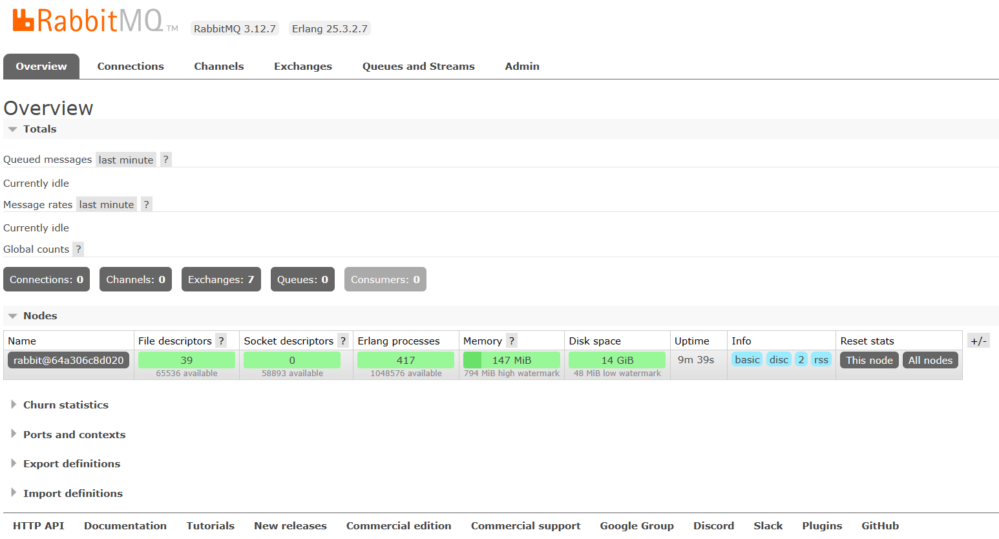
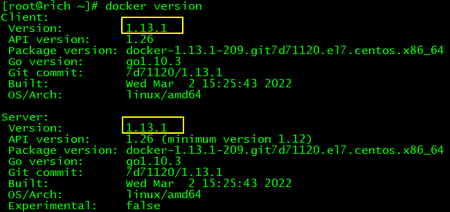
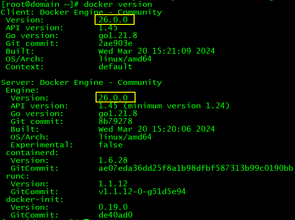

# 操作001：RabbitMQ安装

# 一、安装

```shell
# 拉取镜像
docker pull rabbitmq:3.13-management

# -d 参数：后台运行 Docker 容器
# --name 参数：设置容器名称
# -p 参数：映射端口号，格式是“宿主机端口号:容器内端口号”。5672供客户端程序访问，15672供后台管理界面访问
# -v 参数：卷映射目录
# -e 参数：设置容器内的环境变量，这里我们设置了登录RabbitMQ管理后台的默认用户和密码
docker run -d \
--name rabbitmq \
-p 5672:5672 \
-p 15672:15672 \
-v rabbitmq-plugin:/plugins \
-e RABBITMQ_DEFAULT_USER=guest \
-e RABBITMQ_DEFAULT_PASS=123456 \
rabbitmq:3.13-management
```


<br/>


# 二、验证

访问后台管理界面：http://192.168.200.100:15672


<br/>

使用上面创建Docker容器时指定的默认用户名、密码登录：


<br/>





<br/>


# 三、可能的问题

## 1、问题现象

在使用Docker拉取RabbitMQ镜像的时候，如果遇到提示：missing signature key，那就说明Docker版本太低了，需要升级

比如我目前的Docker版本如下图所示：




## 2、解决办法

> 基于CentOS7

### ①卸载当前Docker

更好的办法是安装Docker前曾经给服务器拍摄了快照，此时恢复快照；

如果不曾拍摄快照，那只能执行卸载操作了

```shell
yum erase -y docker \
	docker-client \
	docker-client-latest \
	docker-common \
	docker-latest \
	docker-latest-logrotate \
	docker-logrotate \
	docker-selinux \
	docker-engine-selinux \
	docker-engine \
	docker-ce
```


### ②升级yum库

```shell
yum update -y
```


### ③安装Docker最新版

```shell
yum install -y docker-ce docker-ce-cli containerd.io docker-buildx-plugin docker-compose-plugin
```


如果这一步看到提示：没有可用软件包 docker-ce，那就添加Docker的yum源：

```shell
yum install -y yum-utils
yum-config-manager --add-repo https://download.docker.com/linux/centos/docker-ce.repo
```


### ④设置Docker服务

```shell
systemctl start docker
systemctl enable docker
```


## 3、验证

上述操作执行完成后，再次查看Docker版本：

