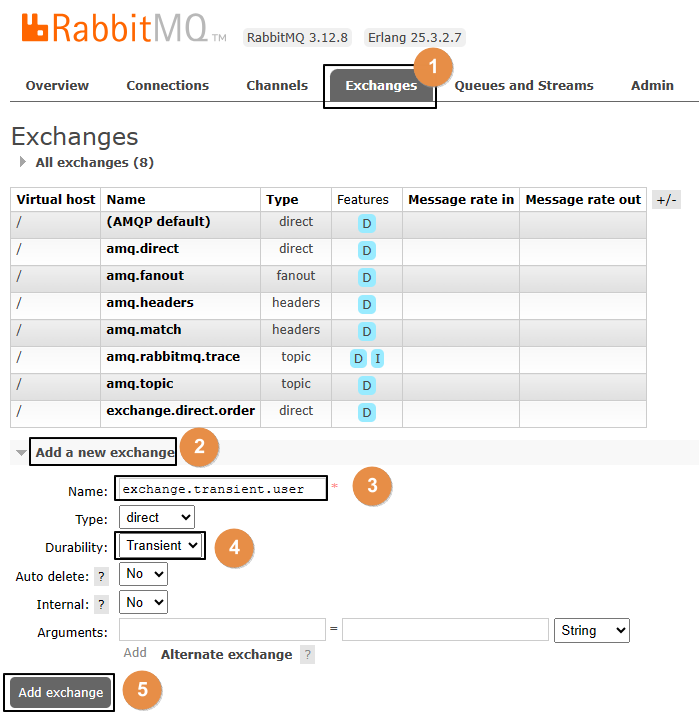
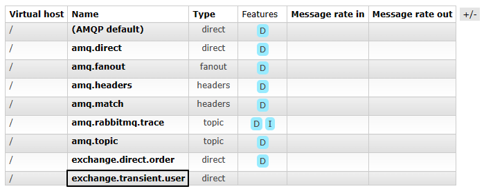
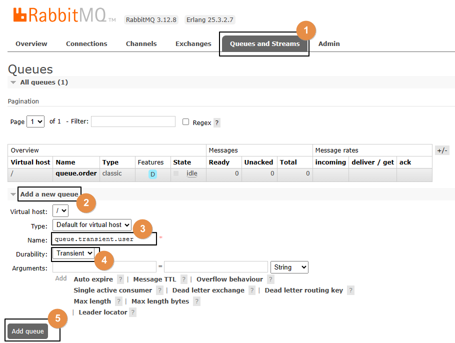
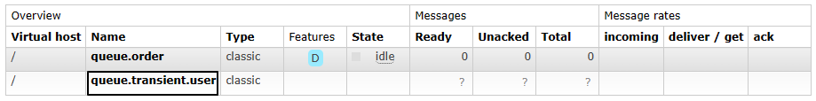
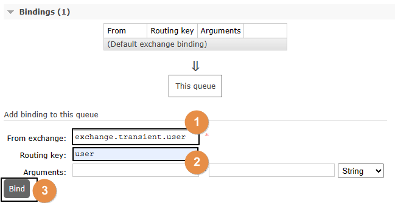
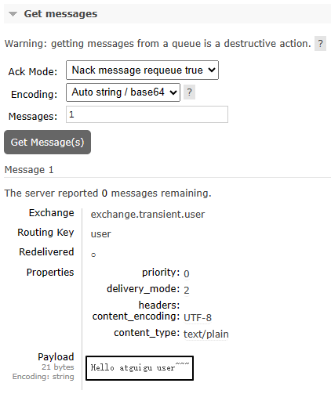
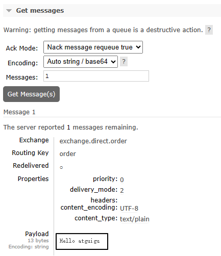

# 操作008-02：交换机和队列持久化

# 一、测试非持久化交换机和队列

## 1、创建非持久化交换机




创建之后，可以在列表中看到：




## 2、创建非持久化队列




创建之后，可以在列表中看到：




## 3、绑定




## 4、发送消息

```java
    public static final String EXCHANGE_TRANSIENT = "exchange.transient.user";
    public static final String ROUTING_KEY_TRANSIENT = "user";

    @Test
    public void testSendMessageTransient() {
        rabbitTemplate.convertAndSend(
                EXCHANGE_TRANSIENT,
                ROUTING_KEY_TRANSIENT,
                "Hello atguigu user~~~");
    }
```


## 5、查看已发送消息



结论：临时性的交换机和队列也能够接收消息，但如果RabbitMQ服务器重启之后会怎么样呢？


## 6、重启RabbitMQ服务器

```shell
docker restart rabbitmq
```

重启之后，刚才临时性的交换机和队列都没了。在交换机和队列这二者中，队列是消息存储的容器，队列没了，消息就也跟着没了。


# 二、持久化的交换机和队列

我们其实不必专门创建持久化的交换机和队列，因为它们默认就是持久化的。接下来我们只需要确认一下：存放到队列中，尚未被消费端取走的消息，是否会随着RabbitMQ服务器重启而丢失？

## 1、发送消息

运行以前的发送消息方法即可，不过要关掉消费端程序


## 2、在管理界面查看消息




## 3、重启RabbitMQ服务器

```shell
docker restart rabbitmq
```


## 4、再次查看消息

仍然还在：


# 三、结论

在后台管理界面创建交换机和队列时，默认就是持久化的模式。

此时消息也是持久化的，不需要额外设置。