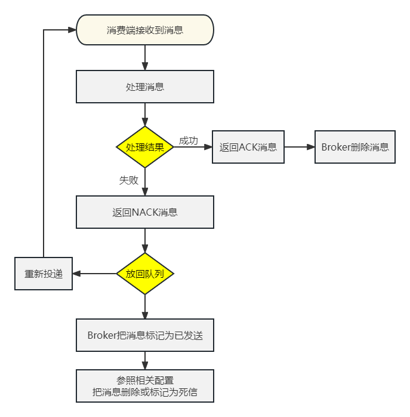

# 操作008-03：消费端消息确认

# 一、ACK

ACK是acknowledge的缩写，表示已确认


# 二、默认情况

默认情况下，消费端取回消息后，默认会自动返回ACK确认消息，所以在前面的测试中消息被消费端消费之后，RabbitMQ得到ACK确认信息就会删除消息

但实际开发中，消费端根据消息队列投递的消息执行对应的业务，未必都能执行成功，如果希望能够多次重试，那么默认设定就不满足要求了

所以还是要修改成手动确认


# 三、创建消费端module

## 1、配置POM

```xml
<parent>
    <groupId>org.springframework.boot</groupId>
    <artifactId>spring-boot-starter-parent</artifactId>
    <version>3.1.5</version>
</parent>

<dependencies>
    <dependency>
        <groupId>org.springframework.boot</groupId>
        <artifactId>spring-boot-starter-amqp</artifactId>
    </dependency>
    <dependency>
        <groupId>org.springframework.boot</groupId>
        <artifactId>spring-boot-starter-web</artifactId>
    </dependency>
    <dependency>
        <groupId>org.projectlombok</groupId>
        <artifactId>lombok</artifactId>
    </dependency>
</dependencies>
```


## 2、YAML

增加针对监听器的设置：

```yaml
spring:
  rabbitmq:
    host: 192.168.200.100
    port: 5672
    username: guest
    password: 123456
    virtual-host: /
    listener:
      simple:
        acknowledge-mode: manual # 把消息确认模式改为手动确认
```


## 3、主启动类

没有特殊设定：

```java
package com.atguigu.mq;

import org.springframework.boot.SpringApplication;
import org.springframework.boot.autoconfigure.SpringBootApplication;

@SpringBootApplication
public class RabbitMQConsumerMainType {

    public static void main(String[] args) {
        SpringApplication.run(RabbitMQConsumerMainType.class, args);
    }

}
```


# 四、消费端监听器

## 1、创建监听器类

```java
package com.atguigu.mq.listener;

import com.rabbitmq.client.Channel;
import org.springframework.amqp.core.Message;
import org.springframework.stereotype.Component;

@Component
public class MyMessageListener {

    public static final String EXCHANGE_DIRECT = "exchange.direct.order";
    public static final String ROUTING_KEY = "order";
    public static final String QUEUE_NAME  = "queue.order";

    public void processMessage(String dataString, Message message, Channel channel) {

    }

}
```


## 2、在接收消息的方法上应用注解

```java
// 修饰监听方法
@RabbitListener(
        // 设置绑定关系
        bindings = @QueueBinding(

            // 配置队列信息：durable 设置为 true 表示队列持久化；autoDelete 设置为 false 表示关闭自动删除
            value = @Queue(value = QUEUE_NAME, durable = "true", autoDelete = "false"),

            // 配置交换机信息：durable 设置为 true 表示队列持久化；autoDelete 设置为 false 表示关闭自动删除
            exchange = @Exchange(value = EXCHANGE_DIRECT, durable = "true", autoDelete = "false"),

            // 配置路由键信息
            key = {ROUTING_KEY}
))
public void processMessage(String dataString, Message message, Channel channel) {

}
```


## 3、接收消息方法内部逻辑

- 业务处理成功：手动返回ACK信息，表示消息成功消费
- 业务处理失败：手动返回NACK信息，表示消息消费失败。此时有两种后续操作供选择：
  - 把消息重新放回消息队列，RabbitMQ会重新投递这条消息，那么消费端将重新消费这条消息——从而让业务代码再执行一遍
  - 不把消息放回消息队列，返回reject信息表示拒绝，那么这条消息的处理就到此为止


## 4、相关API

先回到PPT理解“deliveryTag：交付标签机制”

下面我们探讨的三个方法都是来自于com.rabbitmq.client.<span style="color:blue;font-weight:bolder;">Channel</span>接口

### ①basicAck()方法

- 方法功能：给Broker返回ACK确认信息，表示消息已经在消费端成功消费，这样Broker就可以把消息删除了
- 参数列表：

| 参数名称         | 含义                                                         |
| ---------------- | ------------------------------------------------------------ |
| long deliveryTag | Broker给每一条进入队列的消息都设定一个唯一标识               |
| boolean multiple | 取值为true：为小于、等于deliveryTag的消息批量返回ACK信息<br/>取值为false：仅为指定的deliveryTag返回ACK信息 |


### ②basicNack()方法

- 方法功能：给Broker返回NACK信息，表示消息在消费端消费失败，此时Broker的后续操作取决于参数requeue的值
- 参数列表：

| 参数名称         | 含义                                                         |
| ---------------- | ------------------------------------------------------------ |
| long deliveryTag | Broker给每一条进入队列的消息都设定一个唯一标识               |
| boolean multiple | 取值为true：为小于、等于deliveryTag的消息批量返回ACK信息<br/>取值为false：仅为指定的deliveryTag返回ACK信息 |
| boolean requeue  | 取值为true：Broker将消息重新放回队列，接下来会重新投递给消费端<br/>取值为false：Broker将消息标记为已消费，不会放回队列 |


### ③basicReject()方法

- 方法功能：根据指定的deliveryTag，对该消息表示拒绝
- 参数列表：

| 参数名称         | 含义                                                         |
| ---------------- | ------------------------------------------------------------ |
| long deliveryTag | Broker给每一条进入队列的消息都设定一个唯一标识               |
| boolean requeue  | 取值为true：Broker将消息重新放回队列，接下来会重新投递给消费端<br/>取值为false：Broker将消息标记为已消费，不会放回队列 |

- basicNack()和basicReject()有啥区别？
  - basicNack()有批量操作
  - basicReject()没有批量操作


## 5、完整代码示例

```java
package com.atguigu.mq.listener;

import com.rabbitmq.client.Channel;
import lombok.extern.slf4j.Slf4j;
import org.springframework.amqp.core.Message;
import org.springframework.amqp.rabbit.annotation.Exchange;
import org.springframework.amqp.rabbit.annotation.Queue;
import org.springframework.amqp.rabbit.annotation.QueueBinding;
import org.springframework.amqp.rabbit.annotation.RabbitListener;
import org.springframework.stereotype.Component;

import java.io.IOException;

@Component
@Slf4j
public class MyMessageListener {

    public static final String EXCHANGE_DIRECT = "exchange.direct.order";
    public static final String ROUTING_KEY = "order";
    public static final String QUEUE_NAME  = "queue.order";

    // 修饰监听方法
    @RabbitListener(
            // 设置绑定关系
            bindings = @QueueBinding(

                // 配置队列信息：durable 设置为 true 表示队列持久化；autoDelete 设置为 false 表示关闭自动删除
                value = @Queue(value = QUEUE_NAME, durable = "true", autoDelete = "false"),

                // 配置交换机信息：durable 设置为 true 表示队列持久化；autoDelete 设置为 false 表示关闭自动删除
                exchange = @Exchange(value = EXCHANGE_DIRECT, durable = "true", autoDelete = "false"),

                // 配置路由键信息
                key = {ROUTING_KEY}
    ))
    public void processMessage(String dataString, Message message, Channel channel) throws IOException {

        // 1、获取当前消息的 deliveryTag 值备用
        long deliveryTag = message.getMessageProperties().getDeliveryTag();

        try {
            // 2、正常业务操作
            log.info("消费端接收到消息内容：" + dataString);
            
            // System.out.println(10 / 0);

            // 3、给 RabbitMQ 服务器返回 ACK 确认信息
            channel.basicAck(deliveryTag, false);
        } catch (Exception e) {

            // 4、获取信息，看当前消息是否曾经被投递过
            Boolean redelivered = message.getMessageProperties().getRedelivered();

            if (!redelivered) {
                // 5、如果没有被投递过，那就重新放回队列，重新投递，再试一次
                channel.basicNack(deliveryTag, false, true);
            } else {
                // 6、如果已经被投递过，且这一次仍然进入了 catch 块，那么返回拒绝且不再放回队列
                channel.basicReject(deliveryTag, false);
            }

        }
    }

}
```


# 五、要点总结

- 要点1：把消息确认模式改为<span style="color:blue;font-weight:bold;">手动确认</span>
- 要点2：调用Channel对象的方法返回信息
  - ACK：Acknowledgement，表示消息处理成功
  - NACK：Negative Acknowledgement，表示消息处理失败
  - Reject：拒绝，同样表示消息处理失败
- 要点3：后续操作
  - requeue为true：重新放回队列，重新投递，再次尝试
  - requeue为false：不放回队列，不重新投递
- 要点4：deliveryTag 消息的唯一标识，查找具体某一条消息的依据


# 六、流程梳理




# 七、多啰嗦一句

消费端如果设定消息重新放回队列，Broker重新投递消息，那么消费端就可以再次消费消息，这是一种“重试”机制，这需要消费端代码支持“<span style="color:blue;font-weight:bold;">幂等性</span>”——这属于前置知识，不展开了。
