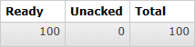
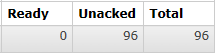
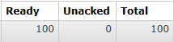
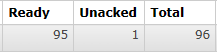
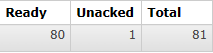
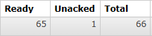

# 操作009：Prefetch

# 一、思路

- 生产者发送100个消息
- 对照两种情况：
  - 消费端没有设置prefetch参数：100个消息被全部取回
  - 消费端设置prefetch参数为1：100个消息慢慢取回


# 二、生产者端代码

```java
@Test  
public void testSendMessage() {
    for (int i = 0; i < 100; i++) {
        rabbitTemplate.convertAndSend(
                EXCHANGE_DIRECT,
                ROUTING_KEY,
                "Hello atguigu" + i);
    }
}
```


# 三、消费者端代码

```java
// 2、正常业务操作
log.info("消费端接收到消息内容：" + dataString);

// System.out.println(10 / 0);
TimeUnit.SECONDS.sleep(1);

// 3、给 RabbitMQ 服务器返回 ACK 确认信息
channel.basicAck(deliveryTag, false);
```


# 四、测试

## 1、未使用prefetch

- 不要启动消费端程序，如果正在运行就把它停了
- 运行生产者端程序发送100条消息
- 查看队列中消息的情况：



- 说明：
  - Ready表示已经发送到队列的消息数量
  - Unacked表示已经发送到消费端但是消费端尚未返回ACK信息的消息数量
  - Total未被删除的消息总数

- 接下来启动消费端程序，再查看队列情况：



- 能看到消息全部被消费端取走了，正在逐个处理、确认，说明有多少消息消费端就并发处理多少


## 2、设定prefetch

### ①YAML配置

```yaml
spring:
  rabbitmq:
    host: 192.168.200.100
    port: 5672
    username: guest
    password: 123456
    virtual-host: /
    listener:
      simple:
        acknowledge-mode: manual
        prefetch: 1 # 设置每次最多从消息队列服务器取回多少消息
```


### ②测试流程

- 停止消费端程序
- 运行生产者端程序发送100条消息
- 查看队列中消息的情况：



- 接下来启动消费端程序，持续观察队列情况：










- 能看到消息不是一次性全部取回的，而是有个过程