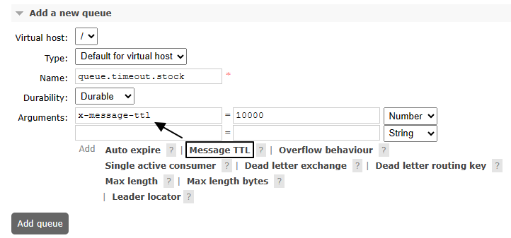
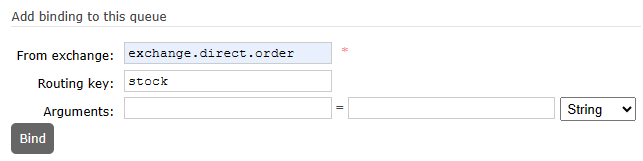

# 操作010：消息超时

# 一、队列层面设置

## 1、设置




别忘了设置绑定关系：




## 2、测试

- 不启动消费端程序
- 向设置了过期时间的队列中发送100条消息
- 等10秒后，看是否全部被过期删除


# 二、消息层面设置

## 1、设置

```java
import org.springframework.amqp.core.Message;
import org.springframework.amqp.core.MessagePostProcessor;

@Test  
public void testSendMessageTTL() {  
  
    // 1、创建消息后置处理器对象  
    MessagePostProcessor messagePostProcessor = (Message message) -> {  
  
        // 设定 TTL 时间，以毫秒为单位
        message.getMessageProperties().setExpiration("5000");  
  
        return message;
    };
  
    // 2、发送消息  
    rabbitTemplate.convertAndSend(    
            EXCHANGE_DIRECT,     
            ROUTING_KEY,     
            "Hello atguigu", messagePostProcessor);    
}
```


## 2、查看效果

这次我们是发送到普通队列上：

