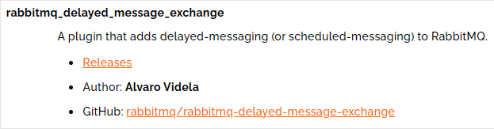
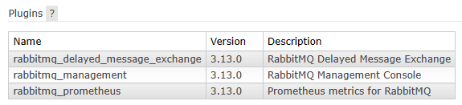
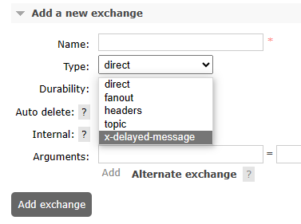
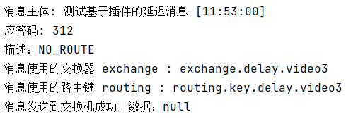
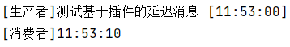

# 操作012：延迟插件

# 一、插件简介

- 官网地址：https://github.com/rabbitmq/rabbitmq-delayed-message-exchange
- 延迟极限：最多两天


# 二、插件安装

## 1、确定卷映射目录

```shell
docker inspect rabbitmq
```


运行结果：

```json
        "Mounts": [
            {
                "Type": "volume",
                "Name": "rabbitmq-plugin",
                "Source": "/var/lib/docker/volumes/rabbitmq-plugin/_data",
                "Destination": "/plugins",
                "Driver": "local",
                "Mode": "z",
                "RW": true,
                "Propagation": ""
            },
            {
                "Type": "volume",
                "Name": "cca7bc3012f5b76bd6c47a49ca6911184f9076f5f6263b41f4b9434a7f269b11",
                "Source": "/var/lib/docker/volumes/cca7bc3012f5b76bd6c47a49ca6911184f9076f5f6263b41f4b9434a7f269b11/_data",
                "Destination": "/var/lib/rabbitmq",
                "Driver": "local",
                "Mode": "",
                "RW": true,
                "Propagation": ""
            }
        ]
```

和容器内/plugins目录对应的宿主机目录是：/var/lib/docker/volumes/rabbitmq-plugin/_data


## 2、下载延迟插件

官方文档说明页地址：https://www.rabbitmq.com/community-plugins.html




下载插件安装文件：

```shell
wget https://github.com/rabbitmq/rabbitmq-delayed-message-exchange/releases/download/v3.13.0/rabbitmq_delayed_message_exchange-3.13.0.ez
mv rabbitmq_delayed_message_exchange-3.13.0.ez /var/lib/docker/volumes/rabbitmq-plugin/_data
```


## 3、启用插件

```shell
# 登录进入容器内部
docker exec -it rabbitmq /bin/bash

# rabbitmq-plugins命令所在目录已经配置到$PATH环境变量中了，可以直接调用
rabbitmq-plugins enable rabbitmq_delayed_message_exchange

# 退出Docker容器
exit

# 重启Docker容器
docker restart rabbitmq
```


## 4、确认

确认点1：查看当前节点已启用插件的列表：




确认点2：如果创建新交换机时可以在type中看到x-delayed-message选项，那就说明插件安装好了




# 三、创建交换机

rabbitmq_delayed_message_exchange插件在工作时要求交换机是<span style="color:blue;font-weight:bolder;">x-delayed-message</span>类型才可以，创建方式如下：


关于<span style="color:blue;font-weight:bolder;">x-delayed-type</span>参数的理解：

> 原本指定交换机类型的地方使用了x-delayed-message这个值，那么这个交换机除了支持延迟消息之外，到底是direct、fanout、topic这些类型中的哪一个呢？
>
> 这里就额外使用x-delayed-type来指定交换机本身的类型


# 四、代码测试

## 1、生产者端代码

```java
@Test
public void testSendDelayMessage() {
    rabbitTemplate.convertAndSend(
            EXCHANGE_DELAY,
            ROUTING_KEY_DELAY,
            "测试基于插件的延迟消息 [" + new SimpleDateFormat("hh:mm:ss").format(new Date()) + "]",
            messageProcessor -> {

                // 设置延迟时间：以毫秒为单位
                messageProcessor.getMessageProperties().setHeader("x-delay", "10000");

                return messageProcessor;
            });
}
```


## 2、消费者端代码

### ①情况A：资源已创建

```java
package com.atguigu.mq.listener;

import com.rabbitmq.client.Channel;
import lombok.extern.slf4j.Slf4j;
import org.springframework.amqp.core.Message;
import org.springframework.amqp.rabbit.annotation.RabbitListener;
import org.springframework.stereotype.Component;

import java.io.IOException;
import java.text.SimpleDateFormat;
import java.util.Date;  
  
@Component  
@Slf4j
public class MyDelayMessageListener {
    
    public static final String QUEUE_DELAY = "queue.delay.video";
    
    @RabbitListener(queues = {QUEUE_DELAY})
    public void process(String dataString, Message message, Channel channel) throws IOException {  
        log.info("[生产者]" + dataString);
        log.info("[消费者]" + new SimpleDateFormat("hh:mm:ss").format(new Date()));
        channel.basicAck(message.getMessageProperties().getDeliveryTag(), false);
    }

}
```


### ②情况B：资源未创建

```java
package com.atguigu.mq.listener;  

import com.rabbitmq.client.Channel;
import lombok.extern.slf4j.Slf4j;
import org.springframework.amqp.core.Message;  
import org.springframework.amqp.rabbit.annotation.*;  
import org.springframework.stereotype.Component;  

import java.io.IOException;  
import java.text.SimpleDateFormat;  
import java.util.Date;  
  
@Component  
@Slf4j
public class MyDelayMessageListener {  
  
    public static final String EXCHANGE_DELAY = "exchange.delay.video";
    public static final String ROUTING_KEY_DELAY = "routing.key.delay.video";
    public static final String QUEUE_DELAY = "queue.delay.video";
  
    @RabbitListener(bindings = @QueueBinding(  
        value = @Queue(value = QUEUE_DELAY, durable = "true", autoDelete = "false"),  
        exchange = @Exchange(  
                value = EXCHANGE_DELAY,   
                durable = "true",   
                autoDelete = "false",   
                type = "x-delayed-message",   
                arguments = @Argument(name = "x-delayed-type", value = "direct")),  
        key = {ROUTING_KEY_DELAY}  
    ))  
    public void process(String dataString, Message message, Channel channel) throws IOException {  
        log.info("[生产者]" + dataString);  
        log.info("[消费者]" + new SimpleDateFormat("hh:mm:ss").format(new Date()));  
        channel.basicAck(message.getMessageProperties().getDeliveryTag(), false);  
    }  

}
```


## 3、执行效果

### ①交换机类型


### ②生产者端效果

<span style="color:blue;font-weight:bolder;">注意</span>：使用rabbitmq_delayed_message_exchange插件后，即使消息成功发送到队列上，也会导致returnedMessage()方法执行




### ③消费者端效果


