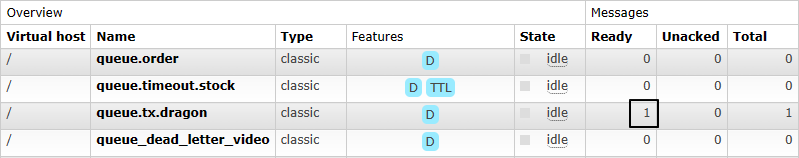
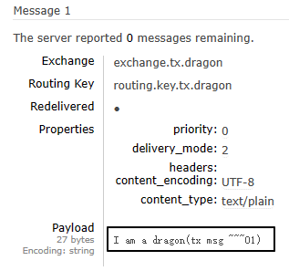
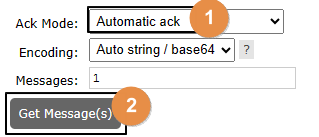
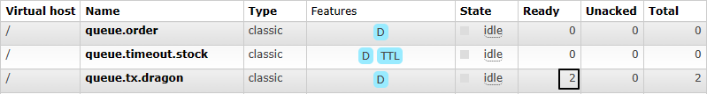
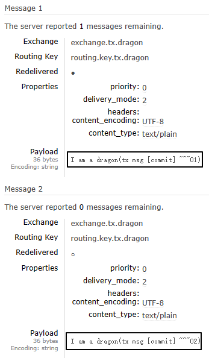
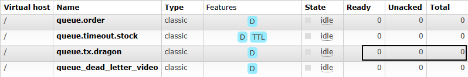

# 操作013：事务消息之生产者端

# 一、测试代码

## 1、引入依赖

```xml
<parent>
    <groupId>org.springframework.boot</groupId>
    <artifactId>spring-boot-starter-parent</artifactId>
    <version>3.1.5</version>
</parent>

<dependencies>
    <dependency>
        <groupId>org.springframework.boot</groupId>
        <artifactId>spring-boot-starter-amqp</artifactId>
    </dependency>
    <dependency>
        <groupId>org.springframework.boot</groupId>
        <artifactId>spring-boot-starter-test</artifactId>
    </dependency>
    <dependency>
        <groupId>org.projectlombok</groupId>
        <artifactId>lombok</artifactId>
    </dependency>
</dependencies>
```


## 2、yaml配置

```yaml
spring:
  rabbitmq:
    host: 192.168.200.100
    port: 5672
    username: guest
    password: 123456
    virtual-host: /
```


## 3、主启动类

```java
package com.atguigu.mq;

import org.springframework.boot.SpringApplication;
import org.springframework.boot.autoconfigure.SpringBootApplication;

@SpringBootApplication
public class RabbitMQProducerMainType {

    public static void main(String[] args) {
        SpringApplication.run(RabbitMQProducerMainType.class, args);
    }

}
```


## 4、相关配置

```java
package com.atguigu.mq.config;

import lombok.Data;
import org.springframework.amqp.rabbit.connection.CachingConnectionFactory;
import org.springframework.amqp.rabbit.core.RabbitTemplate;
import org.springframework.amqp.rabbit.transaction.RabbitTransactionManager;
import org.springframework.context.annotation.Bean;
import org.springframework.context.annotation.Configuration;

@Configuration
@Data
public class RabbitConfig {

    @Bean
    public RabbitTransactionManager transactionManager(CachingConnectionFactory connectionFactory) {
        return new RabbitTransactionManager(connectionFactory);
    }

    @Bean
    public RabbitTemplate rabbitTemplate(CachingConnectionFactory connectionFactory) {
        RabbitTemplate rabbitTemplate = new RabbitTemplate(connectionFactory);
        rabbitTemplate.setChannelTransacted(true);
        return rabbitTemplate;
    }
}
```


## 5、测试代码

```java
package com.atguigu.mq.test;

import jakarta.annotation.Resource;
import lombok.extern.slf4j.Slf4j;
import org.junit.jupiter.api.Test;
import org.springframework.amqp.rabbit.core.RabbitTemplate;
import org.springframework.boot.test.context.SpringBootTest;

@SpringBootTest
@Slf4j
public class RabbitMQTest {

    public static final String EXCHANGE_NAME = "exchange.tx.dragon";
    public static final String ROUTING_KEY = "routing.key.tx.dragon";

    @Resource
    private RabbitTemplate rabbitTemplate;

    @Test
    public void testSendMessageInTx() {
        // 1、发送第一条消息
        rabbitTemplate.convertAndSend(EXCHANGE_NAME, ROUTING_KEY, "I am a dragon(tx msg ~~~01)");

        // 2、抛出异常
        log.info("do bad:" + 10 / 0);

        // 3、发送第二条消息
        rabbitTemplate.convertAndSend(EXCHANGE_NAME, ROUTING_KEY, "I am a dragon(tx msg ~~~02)");
    }

}
```


# 二、执行测试

## 1、未使用事务

抛出异常前的消息发送了，抛异常后的消息没有发送：







为了不影响后续操作，我们直接在管理界面这里把这条消息消费掉：




## 2、使用事务

### ①说明

因为在junit中给测试方法使用@Transactional注解默认就会回滚，所以回滚操作需要使用@RollBack注解操控


### ②测试提交事务的情况

```java
@Test
@Transactional
@Rollback(value = false)
public void testSendMessageInTx() {
    // 1、发送第一条消息
    rabbitTemplate.convertAndSend(EXCHANGE_NAME, ROUTING_KEY, "I am a dragon(tx msg [commit] ~~~01)");

    // 2、发送第二条消息
    rabbitTemplate.convertAndSend(EXCHANGE_NAME, ROUTING_KEY, "I am a dragon(tx msg [commit] ~~~02)");
}
```








### ③测试回滚事务的情况

```java
@Test
@Transactional
@Rollback(value = true)
public void testSendMessageInTx() {
    // 1、发送第一条消息
    rabbitTemplate.convertAndSend(EXCHANGE_NAME, ROUTING_KEY, "I am a dragon(tx msg [rollback] ~~~01)");

    // 2、发送第二条消息
    rabbitTemplate.convertAndSend(EXCHANGE_NAME, ROUTING_KEY, "I am a dragon(tx msg [rollback] ~~~02)");
}
```




