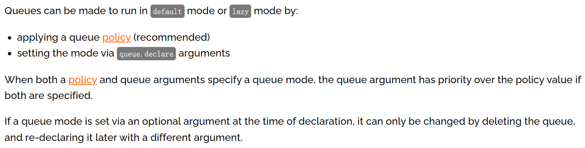
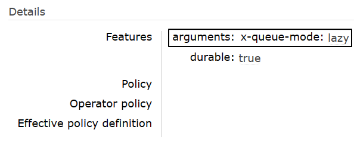

# 操作014：惰性队列

# 一、创建惰性队列

## 1、官网说明




队列可以创建为`默认`或`惰性`模式，模式指定方式是：

- 使用队列策略（建议）
- 设置`queue.declare`参数

如果策略和队列参数同时指定，那么队列参数有更高优先级。如果队列模式是在声明时通过可选参数指定的，那么只能通过删除队列再重新创建来修改。


## 2、基于策略方式设定

```shell
# 登录Docker容器
docker exec -it rabbitmq /bin/bash

# 运行rabbitmqctl命令
rabbitmqctl set_policy Lazy "^lazy-queue$" '{"queue-mode":"lazy"}' --apply-to queues
```

命令解读：

- rabbitmqctl命令所在目录是：/opt/rabbitmq/sbin，该目录已配置到Path环境变量
- set_policy是子命令，表示设置策略
- Lazy是当前要设置的策略名称，是我们自己自定义的，不是系统定义的
- "^lazy-queue$"是用正则表达式限定的队列名称，凡是名称符合这个正则表达式的队列都会应用这里的设置
- '{"queue-mode":"lazy"}'是一个JSON格式的参数设置指定了队列的模式为"lazy"
- –-apply-to参数指定该策略将应用于队列（queues）级别

- 命令执行后，所有名称符合正则表达式的队列都会应用指定策略，包括未来新创建的队列


如果需要修改队列模式可以执行如下命令（不必删除队列再重建）：

```shell
rabbitmqctl set_policy Lazy "^lazy-queue$" '{"queue-mode":"default"}' --apply-to queues
```


## 3、在声明队列时使用参数设定

- 参数名称：x-queue-mode
- 可用参数值：
  - default
  - lazy
- 不设置就是取值为default

Java代码原生API设置方式：

```java
Map<String, Object> args = new HashMap<String, Object>();
args.put("x-queue-mode", "lazy");
channel.queueDeclare("myqueue", false, false, false, args);
```


Java代码注解设置方式：

```java
@Queue(value = QUEUE_NAME, durable = "true", autoDelete = "false", arguments = {
	@Argument(name = "x-queue-mode", value = "lazy")
})
```


# 二、实操演练

## 1、生产者端代码

### ①配置POM

```xml
    <parent>
        <groupId>org.springframework.boot</groupId>
        <artifactId>spring-boot-starter-parent</artifactId>
        <version>3.1.5</version>
    </parent>

    <dependencies>
        <dependency>
            <groupId>org.springframework.boot</groupId>
            <artifactId>spring-boot-starter-amqp</artifactId>
        </dependency>
        <dependency>
            <groupId>org.springframework.boot</groupId>
            <artifactId>spring-boot-starter-test</artifactId>
        </dependency>
        <dependency>
            <groupId>org.projectlombok</groupId>
            <artifactId>lombok</artifactId>
        </dependency>
    </dependencies>
```


### ②配置YAML

```yaml
spring:
  rabbitmq:
    host: 192.168.200.100
    port: 5672
    username: guest
    password: 123456
    virtual-host: /
```


### ③主启动类

```java
package com.atguigu.mq;

import org.springframework.boot.SpringApplication;
import org.springframework.boot.autoconfigure.SpringBootApplication;

@SpringBootApplication
public class RabbitMQLazyProducer {

    public static void main(String[] args) {
        SpringApplication.run(RabbitMQLazyProducer.class, args);
    }

}
```


### ④发送消息

```java
package com.atguigu.mq.test;

import jakarta.annotation.Resource;
import org.junit.jupiter.api.Test;
import org.springframework.amqp.rabbit.core.RabbitTemplate;
import org.springframework.boot.test.context.SpringBootTest;

@SpringBootTest
public class RabbitMQTest {

    public static final String EXCHANGE_LAZY_NAME = "exchange.atguigu.lazy";
    public static final String ROUTING_LAZY_KEY = "routing.key.atguigu.lazy";

    @Resource
    private RabbitTemplate rabbitTemplate;

    @Test
    public void testSendMessage() {
        rabbitTemplate.convertAndSend(EXCHANGE_LAZY_NAME, ROUTING_LAZY_KEY, "I am a message for test lazy queue.");
    }

}
```


## 2、消费者端代码

### ①配置POM

```xml
    <parent>
        <groupId>org.springframework.boot</groupId>
        <artifactId>spring-boot-starter-parent</artifactId>
        <version>3.1.5</version>
    </parent>

    <dependencies>
        <dependency>
            <groupId>org.springframework.boot</groupId>
            <artifactId>spring-boot-starter-amqp</artifactId>
        </dependency>
        <dependency>
            <groupId>org.springframework.boot</groupId>
            <artifactId>spring-boot-starter-web</artifactId>
        </dependency>
        <dependency>
            <groupId>org.projectlombok</groupId>
            <artifactId>lombok</artifactId>
        </dependency>
    </dependencies>
```


### ②配置YAML

```yaml
spring:
  rabbitmq:
    host: 192.168.200.100
    port: 5672
    username: guest
    password: 123456
    virtual-host: /
```


### ③主启动类

```java
package com.atguigu.mq;

import org.springframework.boot.SpringApplication;
import org.springframework.boot.autoconfigure.SpringBootApplication;

@SpringBootApplication
public class RabbitMQLazyConsumerMainType {

    public static void main(String[] args) {
        SpringApplication.run(RabbitMQLazyConsumerMainType.class, args);
    }
    
}
```


### ④监听器

```java
package com.atguigu.mq.listener;

import com.rabbitmq.client.Channel;
import lombok.extern.slf4j.Slf4j;
import org.springframework.amqp.core.Message;
import org.springframework.amqp.rabbit.annotation.*;
import org.springframework.stereotype.Component;

@Component
@Slf4j
public class MyLazyMessageProcessor {

    public static final String EXCHANGE_LAZY_NAME = "exchange.atguigu.lazy";
    public static final String ROUTING_LAZY_KEY = "routing.key.atguigu.lazy";
    public static final String QUEUE_LAZY_NAME = "queue.atguigu.lazy";

    @RabbitListener(bindings = @QueueBinding(
        value = @Queue(value = QUEUE_LAZY_NAME, durable = "true", autoDelete = "false", arguments = {
            @Argument(name = "x-queue-mode", value = "lazy")
        }),
        exchange = @Exchange(value = EXCHANGE_LAZY_NAME, durable = "true", autoDelete = "false"),
        key = {ROUTING_LAZY_KEY}
    ))
    public void processMessageLazy(String data, Message message, Channel channel) {
        log.info("消费端接收到消息：" + data);
    }

}
```


# 三、测试

- 先启动消费端

- 基于消费端@RabbitListener注解中的配置，自动创建了队列



- 发送消息