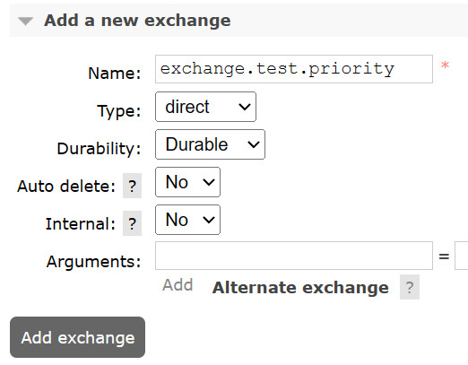
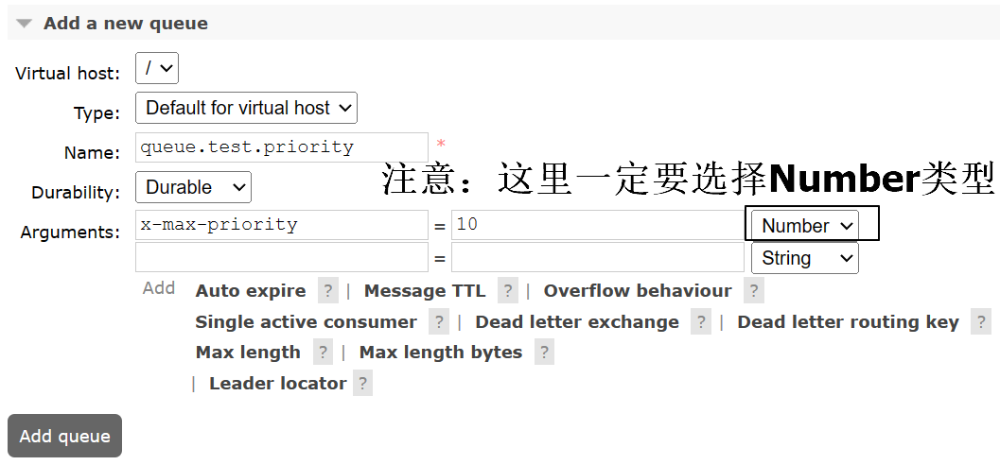
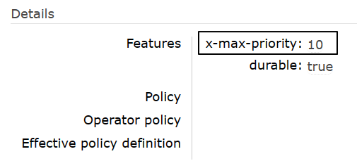
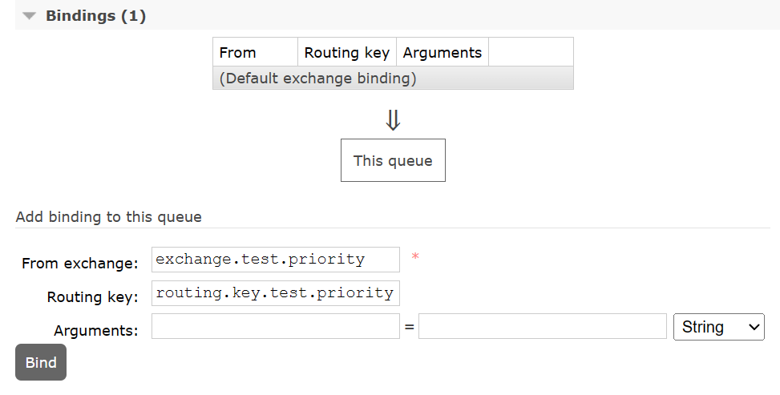
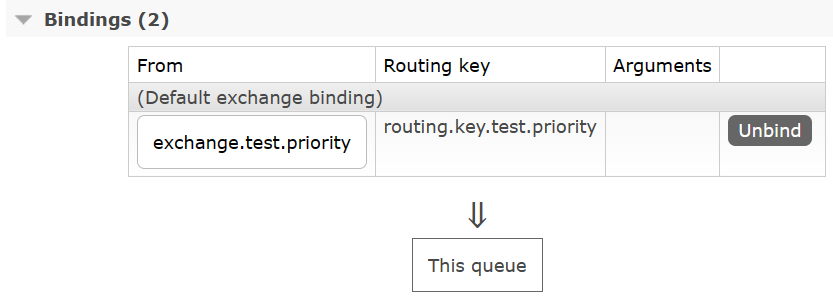
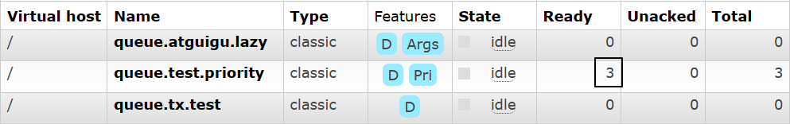
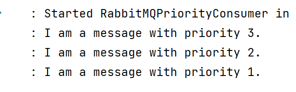

# 操作015：优先级队列

# 一、创建相关资源

## 1、创建交换机

exchange.test.priority




## 2、创建队列

queue.test.priority

x-max-priority







## 3、队列绑定交换机







# 二、生产者发送消息

## 1、配置POM

```xml
<parent>
    <groupId>org.springframework.boot</groupId>
    <artifactId>spring-boot-starter-parent</artifactId>
    <version>3.1.5</version>
</parent>

<dependencies>
    <dependency>
        <groupId>org.springframework.boot</groupId>
        <artifactId>spring-boot-starter-amqp</artifactId>
    </dependency>
    <dependency>
        <groupId>org.springframework.boot</groupId>
        <artifactId>spring-boot-starter-test</artifactId>
    </dependency>
    <dependency>
        <groupId>org.projectlombok</groupId>
        <artifactId>lombok</artifactId>
    </dependency>
</dependencies>
```


## 2、配置YAML

```yaml
spring:
  rabbitmq:
    host: 192.168.200.100
    port: 5672
    username: guest
    password: 123456
    virtual-host: /
```


## 3、主启动类

```java
package com.atguigu.mq;

import org.springframework.boot.SpringApplication;
import org.springframework.boot.autoconfigure.SpringBootApplication;

@SpringBootApplication
public class RabbitMQPriorityProducer {

    public static void main(String[] args) {
        SpringApplication.run(RabbitMQPriorityProducer.class, args);
    }

}
```


## 4、发送消息

- 不要启动消费者程序，让多条不同优先级的消息滞留在队列中
- 第一次发送优先级为1的消息
- 第二次发送优先级为2的消息
- 第三次发送优先级为3的消息
- 先发送的消息优先级低，后发送的消息优先级高，将来看看消费端是不是先收到优先级高的消息

### ①第一次发送优先级为1的消息

```java
package com.atguigu.mq.test;

import jakarta.annotation.Resource;
import org.junit.jupiter.api.Test;
import org.springframework.amqp.rabbit.core.RabbitTemplate;
import org.springframework.boot.test.context.SpringBootTest;

@SpringBootTest
public class RabbitMQTest {

    public static final String EXCHANGE_PRIORITY = "exchange.test.priority";
    public static final String ROUTING_KEY_PRIORITY = "routing.key.test.priority";

    @Resource
    private RabbitTemplate rabbitTemplate;

    @Test
    public void testSendMessage() {
        rabbitTemplate.convertAndSend(EXCHANGE_PRIORITY, ROUTING_KEY_PRIORITY, "I am a message with priority 1.", message->{
            message.getMessageProperties().setPriority(1);
            return message;
        });
    }

}
```


### ②第二次发送优先级为2的消息

```java
@Test
public void testSendMessage() {
    rabbitTemplate.convertAndSend(EXCHANGE_PRIORITY, ROUTING_KEY_PRIORITY, "I am a message with priority 2.", message->{
        message.getMessageProperties().setPriority(2);
        return message;
    });
}
```


### ③第三次发送优先级为3的消息

```java
@Test
public void testSendMessage() {
    rabbitTemplate.convertAndSend(EXCHANGE_PRIORITY, ROUTING_KEY_PRIORITY, "I am a message with priority 3.", message->{
        message.getMessageProperties().setPriority(3);
        return message;
    });
}
```





# 三、消费端接收消息

## 1、配置POM

```xml
<parent>
    <groupId>org.springframework.boot</groupId>
    <artifactId>spring-boot-starter-parent</artifactId>
    <version>3.1.5</version>
</parent>

<dependencies>
    <dependency>
        <groupId>org.springframework.boot</groupId>
        <artifactId>spring-boot-starter-amqp</artifactId>
    </dependency>
    <dependency>
        <groupId>org.springframework.boot</groupId>
        <artifactId>spring-boot-starter-web</artifactId>
    </dependency>
    <dependency>
        <groupId>org.projectlombok</groupId>
        <artifactId>lombok</artifactId>
    </dependency>
</dependencies>
```


## 2、配置YAML

```yaml
spring:
  rabbitmq:
    host: 192.168.200.100
    port: 5672
    username: guest
    password: 123456
    virtual-host: /
```


## 3、主启动类

```java
package com.atguigu.mq;

import org.springframework.boot.SpringApplication;
import org.springframework.boot.autoconfigure.SpringBootApplication;

@SpringBootApplication
public class RabbitMQPriorityConsumer {

    public static void main(String[] args) {
        SpringApplication.run(RabbitMQPriorityConsumer.class, args);
    }

}
```


## 4、监听器

```java
package com.atguigu.mq.listener;

import com.rabbitmq.client.Channel;
import lombok.extern.slf4j.Slf4j;
import org.springframework.amqp.core.Message;
import org.springframework.amqp.rabbit.annotation.*;
import org.springframework.stereotype.Component;

@Slf4j
@Component
public class MyMessageProcessor {

    public static final String QUEUE_PRIORITY = "queue.test.priority";

    @RabbitListener(queues = {QUEUE_PRIORITY})
    public void processPriorityMessage(String data, Message message, Channel channel) throws IOException {
        log.info(data);

        channel.basicAck(message.getMessageProperties().getDeliveryTag(), false);
    }

}
```


## 5、测试效果

对于已经滞留服务器的消息，只要消费端一启动，就能够收到消息队列的投递，打印效果如下：

