# 操作016：集群搭建

# 一、安装RabbitMQ

## 1、前置要求

CentOS发行版的版本≥CentOS 8 Stream<br/>

镜像下载地址：https://mirrors.163.com/centos/8-stream/isos/x86_64/CentOS-Stream-8-20240318.0-x86_64-dvd1.iso

RabbitMQ安装方式官方指南：

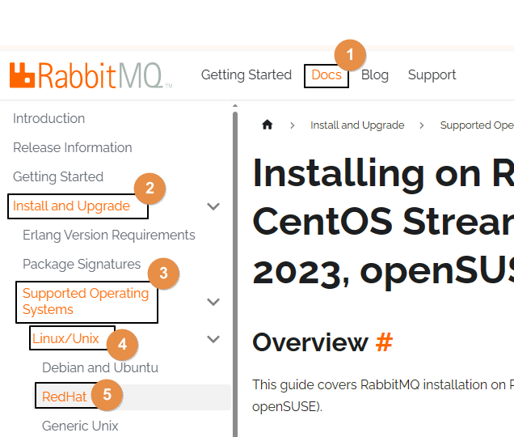


## 2、安装Erlang环境

### ①创建yum库配置文件

```shell
vim /etc/yum.repos.d/rabbitmq.repo
```


### ②加入配置内容

以下内容来自官方文档：https://www.rabbitmq.com/docs/install-rpm

```properties
# In /etc/yum.repos.d/rabbitmq.repo

##
## Zero dependency Erlang RPM
##

[modern-erlang]
name=modern-erlang-el8
# uses a Cloudsmith mirror @ yum.novemberain.com in addition to its Cloudsmith upstream.
# Unlike Cloudsmith, the mirror does not have any traffic quotas
baseurl=https://yum1.novemberain.com/erlang/el/8/$basearch
        https://yum2.novemberain.com/erlang/el/8/$basearch
        https://dl.cloudsmith.io/public/rabbitmq/rabbitmq-erlang/rpm/el/8/$basearch
repo_gpgcheck=1
enabled=1
gpgkey=https://github.com/rabbitmq/signing-keys/releases/download/3.0/cloudsmith.rabbitmq-erlang.E495BB49CC4BBE5B.key
gpgcheck=1
sslverify=1
sslcacert=/etc/pki/tls/certs/ca-bundle.crt
metadata_expire=300
pkg_gpgcheck=1
autorefresh=1
type=rpm-md

[modern-erlang-noarch]
name=modern-erlang-el8-noarch
# uses a Cloudsmith mirror @ yum.novemberain.com.
# Unlike Cloudsmith, it does not have any traffic quotas
baseurl=https://yum1.novemberain.com/erlang/el/8/noarch
        https://yum2.novemberain.com/erlang/el/8/noarch
        https://dl.cloudsmith.io/public/rabbitmq/rabbitmq-erlang/rpm/el/8/noarch
repo_gpgcheck=1
enabled=1
gpgkey=https://github.com/rabbitmq/signing-keys/releases/download/3.0/cloudsmith.rabbitmq-erlang.E495BB49CC4BBE5B.key
       https://github.com/rabbitmq/signing-keys/releases/download/3.0/rabbitmq-release-signing-key.asc
gpgcheck=1
sslverify=1
sslcacert=/etc/pki/tls/certs/ca-bundle.crt
metadata_expire=300
pkg_gpgcheck=1
autorefresh=1
type=rpm-md

[modern-erlang-source]
name=modern-erlang-el8-source
# uses a Cloudsmith mirror @ yum.novemberain.com.
# Unlike Cloudsmith, it does not have any traffic quotas
baseurl=https://yum1.novemberain.com/erlang/el/8/SRPMS
        https://yum2.novemberain.com/erlang/el/8/SRPMS
        https://dl.cloudsmith.io/public/rabbitmq/rabbitmq-erlang/rpm/el/8/SRPMS
repo_gpgcheck=1
enabled=1
gpgkey=https://github.com/rabbitmq/signing-keys/releases/download/3.0/cloudsmith.rabbitmq-erlang.E495BB49CC4BBE5B.key
       https://github.com/rabbitmq/signing-keys/releases/download/3.0/rabbitmq-release-signing-key.asc
gpgcheck=1
sslverify=1
sslcacert=/etc/pki/tls/certs/ca-bundle.crt
metadata_expire=300
pkg_gpgcheck=1
autorefresh=1


##
## RabbitMQ Server
##

[rabbitmq-el8]
name=rabbitmq-el8
baseurl=https://yum2.novemberain.com/rabbitmq/el/8/$basearch
        https://yum1.novemberain.com/rabbitmq/el/8/$basearch
        https://dl.cloudsmith.io/public/rabbitmq/rabbitmq-server/rpm/el/8/$basearch
repo_gpgcheck=1
enabled=1
# Cloudsmith's repository key and RabbitMQ package signing key
gpgkey=https://github.com/rabbitmq/signing-keys/releases/download/3.0/cloudsmith.rabbitmq-server.9F4587F226208342.key
       https://github.com/rabbitmq/signing-keys/releases/download/3.0/rabbitmq-release-signing-key.asc
gpgcheck=1
sslverify=1
sslcacert=/etc/pki/tls/certs/ca-bundle.crt
metadata_expire=300
pkg_gpgcheck=1
autorefresh=1
type=rpm-md

[rabbitmq-el8-noarch]
name=rabbitmq-el8-noarch
baseurl=https://yum2.novemberain.com/rabbitmq/el/8/noarch
        https://yum1.novemberain.com/rabbitmq/el/8/noarch
        https://dl.cloudsmith.io/public/rabbitmq/rabbitmq-server/rpm/el/8/noarch
repo_gpgcheck=1
enabled=1
# Cloudsmith's repository key and RabbitMQ package signing key
gpgkey=https://github.com/rabbitmq/signing-keys/releases/download/3.0/cloudsmith.rabbitmq-server.9F4587F226208342.key
       https://github.com/rabbitmq/signing-keys/releases/download/3.0/rabbitmq-release-signing-key.asc
gpgcheck=1
sslverify=1
sslcacert=/etc/pki/tls/certs/ca-bundle.crt
metadata_expire=300
pkg_gpgcheck=1
autorefresh=1
type=rpm-md

[rabbitmq-el8-source]
name=rabbitmq-el8-source
baseurl=https://yum2.novemberain.com/rabbitmq/el/8/SRPMS
        https://yum1.novemberain.com/rabbitmq/el/8/SRPMS
        https://dl.cloudsmith.io/public/rabbitmq/rabbitmq-server/rpm/el/8/SRPMS
repo_gpgcheck=1
enabled=1
gpgkey=https://github.com/rabbitmq/signing-keys/releases/download/3.0/cloudsmith.rabbitmq-server.9F4587F226208342.key
gpgcheck=0
sslverify=1
sslcacert=/etc/pki/tls/certs/ca-bundle.crt
metadata_expire=300
pkg_gpgcheck=1
autorefresh=1
type=rpm-md
```


### ③更新yum库

--nobest表示所需安装包即使不是最佳选择也接受

```shell
yum update -y --nobest
```


### ④正式安装Erlang

```shell
yum install -y erlang
```


## 3、安装RabbitMQ

```shell
# 导入GPG密钥
rpm --import 'https://github.com/rabbitmq/signing-keys/releases/download/3.0/rabbitmq-release-signing-key.asc'
rpm --import 'https://github.com/rabbitmq/signing-keys/releases/download/3.0/cloudsmith.rabbitmq-erlang.E495BB49CC4BBE5B.key'
rpm --import 'https://github.com/rabbitmq/signing-keys/releases/download/3.0/cloudsmith.rabbitmq-server.9F4587F226208342.key'

# 下载 RPM 包
wget https://github.com/rabbitmq/rabbitmq-server/releases/download/v3.13.0/rabbitmq-server-3.13.0-1.el8.noarch.rpm

# 安装
rpm -ivh rabbitmq-server-3.13.0-1.el8.noarch.rpm
```


## 4、RabbitMQ基础配置

```shell
# 启用管理界面插件
rabbitmq-plugins enable rabbitmq_management

# 启动 RabbitMQ 服务：
systemctl start rabbitmq-server

# 将 RabbitMQ 服务设置为开机自动启动
systemctl enable rabbitmq-server

# 新增登录账号密码
rabbitmqctl add_user atguigu 123456

# 设置登录账号权限
rabbitmqctl set_user_tags atguigu administrator
rabbitmqctl set_permissions -p / atguigu ".*" ".*" ".*"

# 配置所有稳定功能 flag 启用
rabbitmqctl enable_feature_flag all

# 重启RabbitMQ服务生效
systemctl restart rabbitmq-server
```


## 5、收尾工作

```shell
rm -rf /etc/yum.repos.d/rabbitmq.repo
```


# 二、克隆VMWare虚拟机

## 1、目标

通过克隆操作，一共准备三台VMWare虚拟机

| 集群节点名称 | 虚拟机 IP 地址  |
| ------------ | --------------- |
| node01       | 192.168.200.100 |
| node02       | 192.168.200.150 |
| node03       | 192.168.200.200 |


## 2、克隆虚拟机


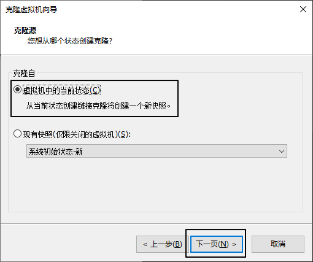


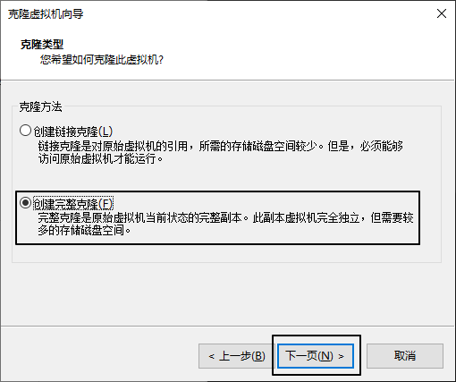


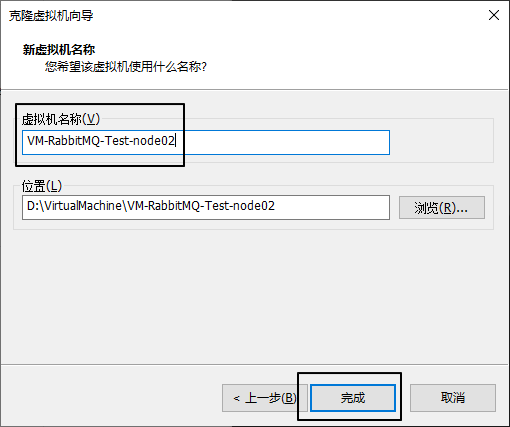


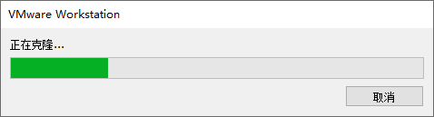


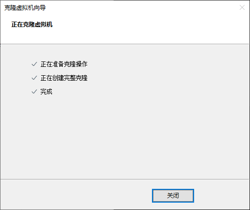


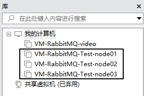


## 3、给新机设置 IP 地址

在CentOS 7中，可以使用`nmcli`命令行工具修改IP地址。以下是具体步骤：

1. 查看网络连接信息：
```shell
nmcli con show
```

2. 停止指定的网络连接（将`<connection_name>`替换为实际的网络连接名称）：
```shell
nmcli con down <connection_name>
```

3. 修改IP地址（将`<connection_name>`替换为实际的网络连接名称，将`<new_ip_address>`替换为新的IP地址，将`<subnet_mask>`替换为子网掩码，将`<gateway>`替换为网关）：
```shell
# <new_ip_address>/<subnet_mask>这里是 CIDR 表示法
nmcli con mod <connection_name> ipv4.addresses <new_ip_address>/<subnet_mask>
nmcli con mod <connection_name> ipv4.gateway <gateway>
nmcli con mod <connection_name> ipv4.method manual
```

4. 启动网络连接：
```shell
nmcli con up <connection_name>
```

5. 验证新的IP地址是否生效：
```shell
ip addr show
```


## 4、修改主机名称

主机名称会被RabbitMQ作为集群中的节点名称，后面会用到，所以需要设置一下。<br/>

修改方式如下：

```shell
vim /etc/hostname
```


## 5、保险措施

为了在后续操作过程中，万一遇到操作失误，友情建议拍摄快照。


# 三、集群节点彼此发现

## 1、node01设置

### ①设置 IP 地址到主机名称的映射

修改文件/etc/hosts，追加如下内容：

```text
192.168.200.100 node01
192.168.200.150 node02
192.168.200.200 node03
```


### ②查看当前RabbitMQ节点的Cookie值并记录

```shell
[root@node01 ~]# cat /var/lib/rabbitmq/.erlang.cookie 
NOTUPTIZIJONXDWWQPOJ
```


### ③重置节点应用

```shell
rabbitmqctl stop_app
rabbitmqctl reset
rabbitmqctl start_app
```


## 2、node02设置

### ①设置 IP 地址到主机名称的映射

修改文件/etc/hosts，追加如下内容：

```text
192.168.200.100 node01
192.168.200.150 node02
192.168.200.200 node03
```


### ②修改当前RabbitMQ节点的Cookie值

node02和node03都改成和node01一样：

```shell
vim /var/lib/rabbitmq/.erlang.cookie
```


### ③重置节点应用并加入集群

```shell
rabbitmqctl stop_app
rabbitmqctl reset
rabbitmqctl join_cluster rabbit@node01
rabbitmqctl start_app
```


## 3、node03设置

### ①设置 IP 地址到主机名称的映射

修改文件/etc/hosts，追加如下内容：

```text
192.168.200.100 node01
192.168.200.150 node02
192.168.200.200 node03
```


### ②修改当前RabbitMQ节点的Cookie值

node02和node03都改成和node01一样：

```shell
vim /var/lib/rabbitmq/.erlang.cookie
```


### ③重置节点应用并加入集群

```shell
rabbitmqctl stop_app
rabbitmqctl reset
rabbitmqctl join_cluster rabbit@node01
rabbitmqctl start_app
```


### ④查看集群状态

```shell
rabbitmqctl cluster_status
```

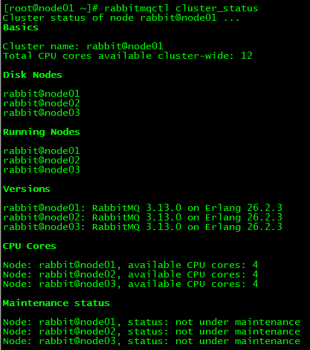


## 4、附录

如有需要踢出某个节点，则按下面操作执行：

```shell
# 被踢出的节点：
rabbitmqctl stop_app
rabbitmqctl reset
rabbitmqctl start_app

# 节点1
rabbitmqctl forget_cluster_node rabbit@node02
```


# 四、负载均衡：Management UI

## 1、说明

- 其实访问任何一个RabbitMQ实例的管理界面都是对集群操作，所以配置负载均衡通过统一入口访问在我们学习期间就是锦上添花
- 先给管理界面做负载均衡，然后方便我们在管理界面上创建交换机、队列等操作


## 2、安装HAProxy

```shell
yum install -y haproxy
haproxy -v
systemctl start haproxy
systemctl enable haproxy
```

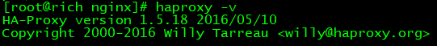


## 3、修改配置文件

配置文件位置：

> /etc/haproxy/haproxy.cfg


在配置文件末尾增加如下内容：

> frontend rabbitmq_ui_frontend
> bind 192.168.200.100:22222
> mode http
> default_backend rabbitmq_ui_backend
>
> backend rabbitmq_ui_backend
> mode http
> balance roundrobin
> option httpchk GET /
> server rabbitmq_ui1 192.168.200.100:15672 check
> server rabbitmq_ui2 192.168.200.150:15672 check
> server rabbitmq_ui3 192.168.200.200:15672 check


设置SELinux策略，允许HAProxy拥有权限连接任意端口：

```shell
setsebool -P haproxy_connect_any=1
```

> SELinux是Linux系统中的安全模块，它可以限制进程的权限以提高系统的安全性。在某些情况下，SELinux可能会阻止HAProxy绑定指定的端口，这就需要通过设置域（domain）的安全策略来解决此问题。
>
> 通过执行`setsebool -P haproxy_connect_any=1`命令，您已经为HAProxy设置了一个布尔值，允许HAProxy连接到任意端口。这样，HAProxy就可以成功绑定指定的socket，并正常工作。
>


重启HAProxy：

```shell
systemctl restart haproxy
```


## 4、测试效果

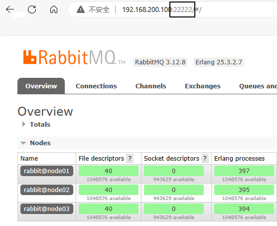


# 五、负载均衡：核心功能

## 1、增加配置

> frontend rabbitmq_frontend
> bind 192.168.200.100:11111
> mode tcp
> default_backend rabbitmq_backend
>
> backend rabbitmq_backend
> mode tcp
> balance roundrobin
> server rabbitmq1 192.168.200.100:5672 check
> server rabbitmq2 192.168.200.150:5672 check
> server rabbitmq3 192.168.200.200:5672 check


重启HAProxy服务：

```shell
systemctl restart haproxy
```


## 3、测试

### ①创建组件

- 交换机：exchange.cluster.test
- 队列：queue.cluster.test
- 路由键：routing.key.cluster.test


### ②创建生产者端程序

#### [1]配置POM

```xml
<parent>
    <groupId>org.springframework.boot</groupId>
    <artifactId>spring-boot-starter-parent</artifactId>
    <version>3.1.5</version>
</parent>

<dependencies>
    <dependency>
        <groupId>org.springframework.boot</groupId>
        <artifactId>spring-boot-starter-amqp</artifactId>
    </dependency>
    <dependency>
        <groupId>org.springframework.boot</groupId>
        <artifactId>spring-boot-starter-test</artifactId>
    </dependency>
    <dependency>
        <groupId>org.projectlombok</groupId>
        <artifactId>lombok</artifactId>
    </dependency>
</dependencies>
```


#### [2]主启动类

```java
package com.atguigu.mq;  
  
import org.springframework.boot.SpringApplication;  
import org.springframework.boot.autoconfigure.SpringBootApplication;  
  
@SpringBootApplication
public class RabbitMQProducerMainType {

    public static void main(String[] args) {
        SpringApplication.run(RabbitMQProducerMainType.class, args);
    }

}
```


#### [3]配置YAML

```yaml
spring:
  rabbitmq:
    host: 192.168.200.100
    port: 11111
    username: atguigu
    password: 123456
    virtual-host: /
    publisher-confirm-type: CORRELATED # 交换机的确认
    publisher-returns: true # 队列的确认
logging:
  level:
    com.atguigu.mq.config.MQProducerAckConfig: info
```


#### [4]配置类

```java
package com.atguigu.mq.config;

import jakarta.annotation.PostConstruct;
import lombok.extern.slf4j.Slf4j;
import org.springframework.amqp.core.ReturnedMessage;
import org.springframework.amqp.rabbit.connection.CorrelationData;
import org.springframework.amqp.rabbit.core.RabbitTemplate;
import org.springframework.beans.factory.annotation.Autowired;
import org.springframework.context.annotation.Configuration;

@Configuration
@Slf4j
public class MQProducerAckConfig implements RabbitTemplate.ConfirmCallback, RabbitTemplate.ReturnsCallback{

    @Autowired
    private RabbitTemplate rabbitTemplate;

    @PostConstruct
    public void init() {
        rabbitTemplate.setConfirmCallback(this);
        rabbitTemplate.setReturnsCallback(this);
    }

    @Override
    public void confirm(CorrelationData correlationData, boolean ack, String cause) {
        if (ack) {
            log.info("消息发送到交换机成功！数据：" + correlationData);
        } else {
            log.info("消息发送到交换机失败！数据：" + correlationData + " 原因：" + cause);
        }
    }

    @Override
    public void returnedMessage(ReturnedMessage returned) {
        log.info("消息主体: " + new String(returned.getMessage().getBody()));
        log.info("应答码: " + returned.getReplyCode());
        log.info("描述：" + returned.getReplyText());
        log.info("消息使用的交换器 exchange : " + returned.getExchange());
        log.info("消息使用的路由键 routing : " + returned.getRoutingKey());
    }
}
```


#### [5] Junit测试类

```java
package com.atguigu.mq.test;

import jakarta.annotation.Resource;
import org.junit.jupiter.api.Test;
import org.springframework.amqp.rabbit.core.RabbitTemplate;
import org.springframework.boot.test.context.SpringBootTest;

@SpringBootTest
public class RabbitMQTest {

    @Resource
    private RabbitTemplate rabbitTemplate;

    public static final String EXCHANGE_CLUSTER_TEST = "exchange.cluster.test";
    public static final String ROUTING_KEY_CLUSTER_TEST = "routing.key.cluster.test";

    @Test
    public void testSendMessage() {
        rabbitTemplate.convertAndSend(EXCHANGE_CLUSTER_TEST, ROUTING_KEY_CLUSTER_TEST, "message test cluster~~~");
    }

}
```


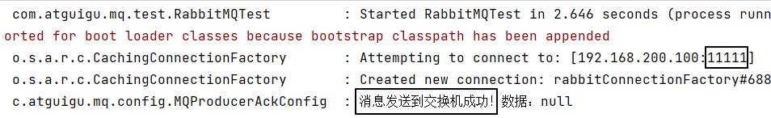


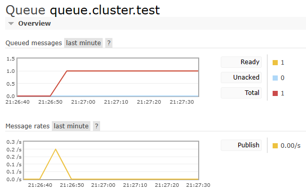


### ③创建消费端程序

#### [1]配置POM

```xml
<parent>
    <groupId>org.springframework.boot</groupId>
    <artifactId>spring-boot-starter-parent</artifactId>
    <version>3.1.5</version>
</parent>

<dependencies>
    <dependency>
        <groupId>org.springframework.boot</groupId>
        <artifactId>spring-boot-starter-amqp</artifactId>
    </dependency>
    <dependency>
        <groupId>org.springframework.boot</groupId>
        <artifactId>spring-boot-starter-web</artifactId>
    </dependency>
    <dependency>
        <groupId>org.projectlombok</groupId>
        <artifactId>lombok</artifactId>
    </dependency>
</dependencies>
```


#### [2]主启动类

```java
package com.atguigu.mq;  
  
import org.springframework.boot.SpringApplication;  
import org.springframework.boot.autoconfigure.SpringBootApplication;  
  
@SpringBootApplication
public class RabbitMQProducerMainType {

    public static void main(String[] args) {
        SpringApplication.run(RabbitMQProducerMainType.class, args);
    }

}
```


#### [3]配置YAML

```yaml
spring:
  rabbitmq:
    host: 192.168.200.100
    port: 11111
    username: atguigu
    password: 123456
    virtual-host: /
    listener:
      simple:
        acknowledge-mode: manual
logging:
  level:
    com.atguigu.mq.listener.MyProcessor: info
```


#### [4]监听器

```java
package com.atguigu.mq.listener;

import com.rabbitmq.client.Channel;
import lombok.extern.slf4j.Slf4j;
import org.springframework.amqp.core.Message;
import org.springframework.amqp.rabbit.annotation.RabbitListener;
import org.springframework.stereotype.Component;

import java.io.IOException;

@Component
@Slf4j
public class MyProcessor {

    @RabbitListener(queues = {"queue.cluster.test"})
    public void processNormalQueueMessage(String data, Message message, Channel channel) 
        throws IOException {
        
        log.info("消费端：" + data);

        channel.basicAck(message.getMessageProperties().getDeliveryTag(), false);
    }

}
```


#### [5]运行效果

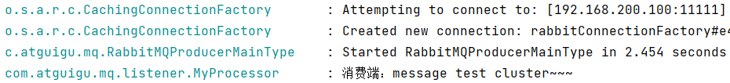


# 六、镜像队列

## 1、提出问题

现在我们创建过的队列，它是属于节点1的：

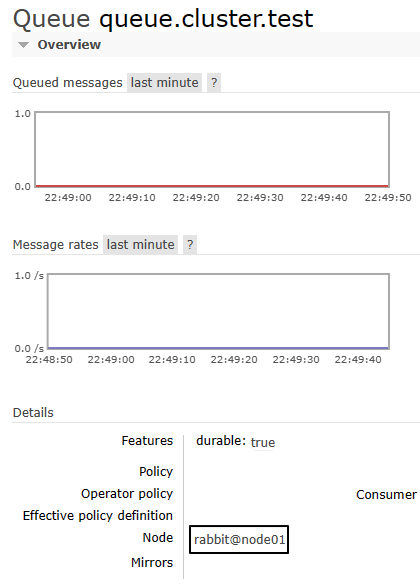


现在我们停掉节点1的rabbit应用：

```shell
# 停止rabbit应用
rabbitmqctl stop_app
```

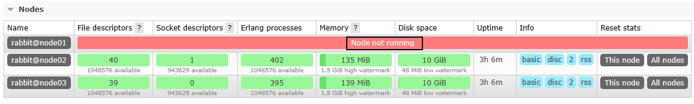


再次发送消息：

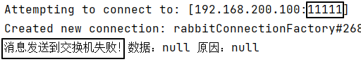


为了后续操作，再重新启动rabbit应用

```shell
rabbitmqctl start_app
```


## 2、创建策略使队列镜像化


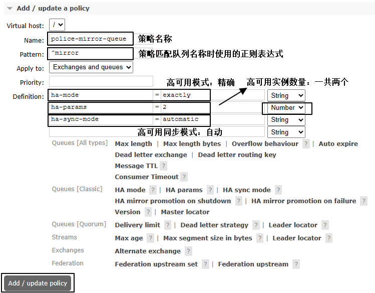


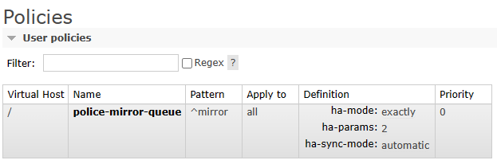


## 3、创建新的队列

<span style="color:blue;font-weight:bolder;">要求</span>：队列名称必须符合策略中指定的正则表达式

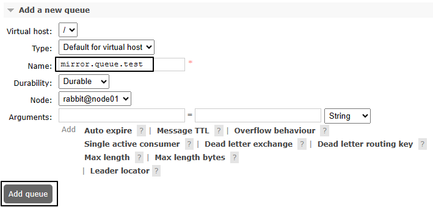


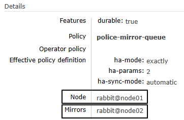


绑定交换机：

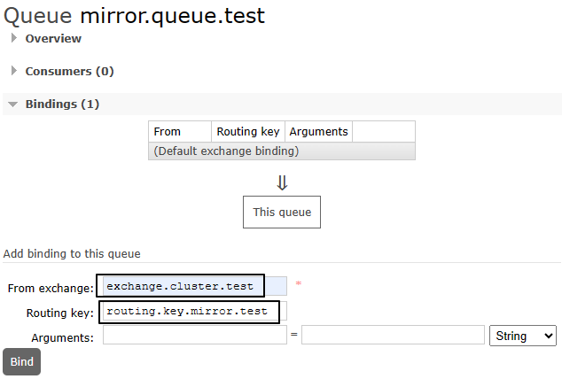


## 4、测试

节点1关闭rabbit应用

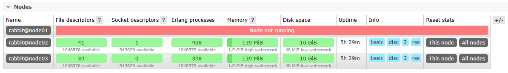


然后就发现两个镜像队列自动分布到了节点2和节点3上：

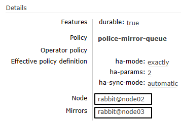


调整Java代码中的组件名称：

```java
public static final String EXCHANGE_CLUSTER_TEST = "exchange.cluster.test";
public static final String ROUTING_KEY_MIRROR_TEST = "routing.key.mirror.test";
public static final String QUEUE_MIRROR_TEST = "mirror.queue.test";
```


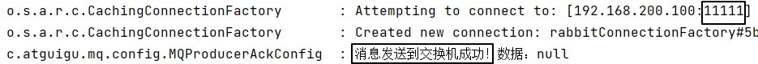


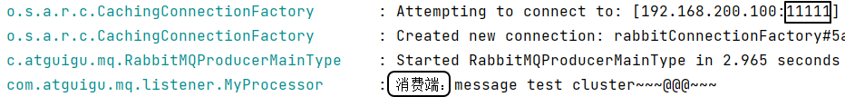


