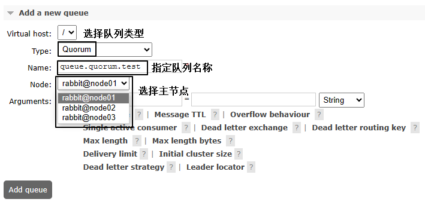
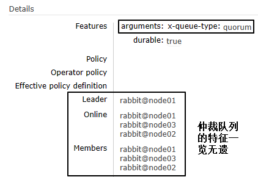
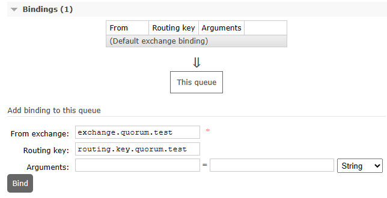
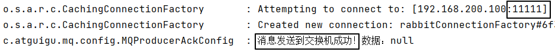
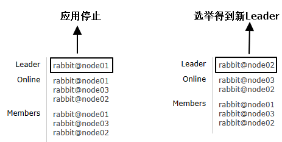

# 操作017：仲裁队列

# 一、创建仲裁队列

> <span style="color:blue;font-weight:bolder;">说明</span>：鉴于仲裁队列的功能，肯定是需要在前面集群的基础上操作！


## 1、创建交换机

和仲裁队列绑定的交换机没有特殊，我们还是创建一个direct交换机即可

交换机名称：exchange.quorum.test


## 2、创建仲裁队列

队列名称：queue.quorum.test







## 3、绑定交换机

路由键：routing.key.quorum.test




# 二、测试仲裁队列

## 1、常规测试

像使用经典队列一样发送消息、消费消息


### ①生产者端

```java
public static final String EXCHANGE_QUORUM_TEST = "exchange.quorum.test";
public static final String ROUTING_KEY_QUORUM_TEST = "routing.key.quorum.test";

@Test
public void testSendMessageToQuorum() {
    rabbitTemplate.convertAndSend(EXCHANGE_QUORUM_TEST, ROUTING_KEY_QUORUM_TEST, "message test quorum ~~~");
}
```





### ②消费者端

```java
public static final String QUEUE_QUORUM_TEST = "queue.quorum.test";

@RabbitListener(queues = {QUEUE_QUORUM_TEST})
public void quorumMessageProcess(String data, Message message, Channel channel) throws IOException {
    log.info("消费端：" + data);
    channel.basicAck(message.getMessageProperties().getDeliveryTag(), false);
}
```


## 2、高可用测试

### ①停止某个节点的rabbit应用

```shell
# 停止rabbit应用
rabbitmqctl stop_app
```


### ②查看仲裁队列对应的节点情况




### ③再次发送消息

收发消息仍然正常