# 操作024：Federation插件

# 一、简介

Federation插件的设计目标是使RabbitMQ在不同的Broker节点之间进行消息传递而无须建立集群。

它可以在不同的管理域中的Broker或集群间传递消息，这些管理域可能设置了不同的用户和vhost，也可能运行在不同版本的RabbitMQ和Erlang上。Federation基于AMQP 0-9-1协议在不同的Broker之间进行通信，并且设计成能够容忍不稳定的网络连接情况。


# 二、Federation交换机

## 1、总体说明

- 各节点操作：启用联邦插件
- 下游操作：
  - 添加上游连接端点
  - 创建控制策略


## 2、准备工作

为了执行相关测试，我们使用Docker创建两个RabbitMQ实例。

<span style="color:blue;">**特别提示**</span>：由于Federation机制的最大特点就是跨集群同步数据，所以这两个Docker容器中的RabbitMQ实例不加入集群！！！是两个<span style="color:blue;">**独立的broker实例**</span>。

```shell
docker run -d \
--name rabbitmq-shenzhen \
-p 51000:5672 \
-p 52000:15672 \
-v rabbitmq-plugin:/plugins \
-e RABBITMQ_DEFAULT_USER=guest \
-e RABBITMQ_DEFAULT_PASS=123456 \
rabbitmq:3.13-management

docker run -d \
--name rabbitmq-shanghai \
-p 61000:5672 \
-p 62000:15672 \
-v rabbitmq-plugin:/plugins \
-e RABBITMQ_DEFAULT_USER=guest \
-e RABBITMQ_DEFAULT_PASS=123456 \
rabbitmq:3.13-management
```


## 3、启用联邦插件

在上游、下游节点中都需要开启。

Docker容器中的RabbitMQ已经开启了rabbitmq_federation，还需要开启rabbitmq_federation_management

```shell
rabbitmq-plugins enable rabbitmq_federation
rabbitmq-plugins enable rabbitmq_federation_management
```

rabbitmq_federation_management插件启用后会在Management UI的Admin选项卡下看到：

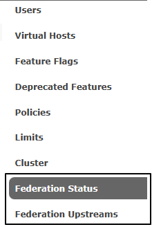


## 4、添加上游连接端点

在下游节点填写上游节点的连接信息：

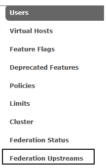


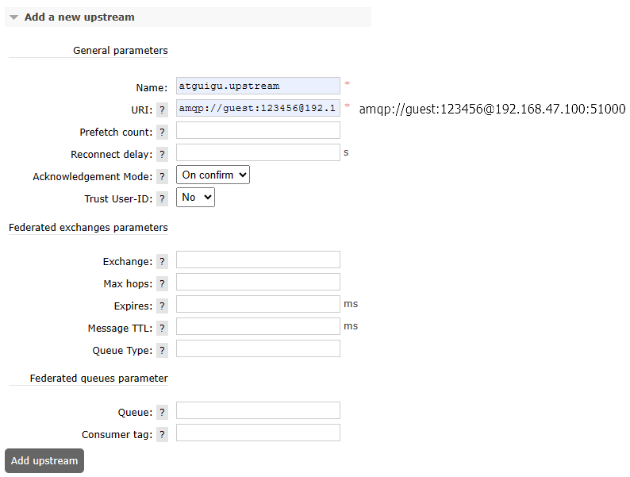


## 5、创建控制策略

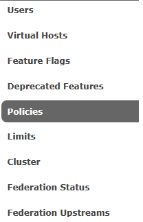


## 6、测试

### ①测试计划

<span style="color:blue;">**特别提示**</span>：

- 普通交换机和联邦交换机名称要一致
- 交换机名称要能够和策略正则表达式匹配上
- 发送消息时，两边使用的路由键也要一致
- 队列名称不要求一致


### ②创建组件

| 所在机房         | 交换机名称              | 路由键                | 队列名称              |
| ---------------- | ----------------------- | --------------------- | --------------------- |
| 深圳机房（上游） | federated.exchange.demo | routing.key.demo.test | queue.normal.shenzhen |
| 上海机房（下游） | federated.exchange.demo | routing.key.demo.test | queue.normal.shanghai |

创建组件后可以查看一下联邦状态，连接成功的联邦状态如下：

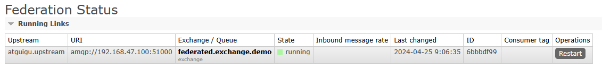


### ③发布消息执行测试

在上游节点向交换机发布消息：

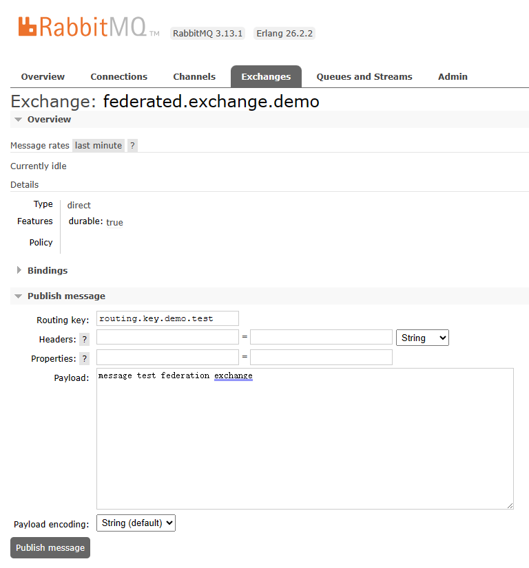


看到下游节点接收到了消息：

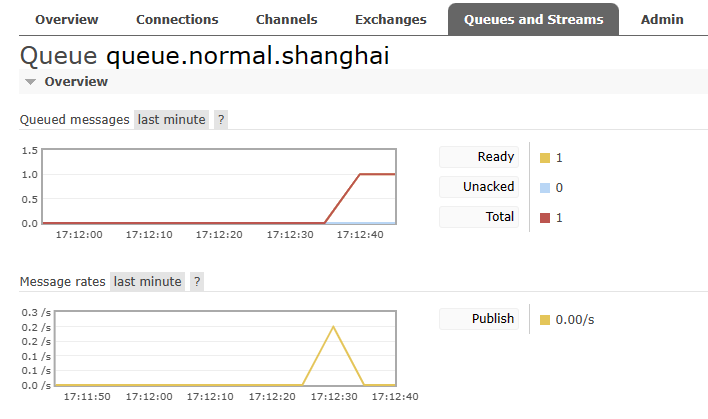


# 三、Federation队列

## 1、总体说明

Federation队列和Federation交换机的最核心区别就是：

- Federation Police作用在交换机上，就是Federation交换机
- Federation Police作用在队列上，就是Federation队列


## 2、创建控制策略

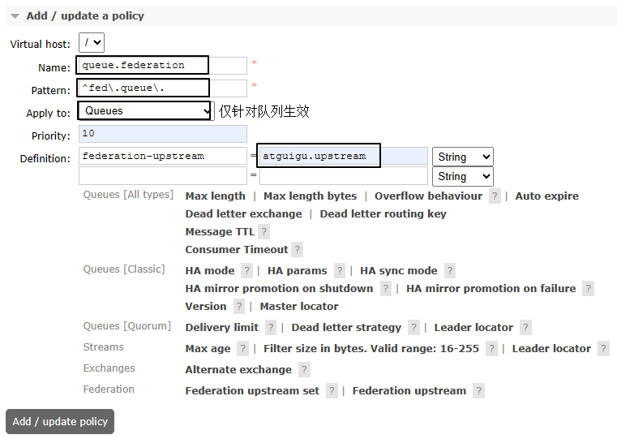


## 3、测试

### ①测试计划

上游节点和下游节点中队列名称是相同的，只是下游队列中的节点附加了联邦策略而已

| 所在机房         | 交换机                   | 路由键                      | 队列           |
| ---------------- | ------------------------ | --------------------------- | -------------- |
| 深圳机房（上游） | exchange.normal.shenzhen | routing.key.normal.shenzhen | fed.queue.demo |
| 上海机房（下游） | ——                       | ——                          | fed.queue.demo |


### ②创建组件

上游节点都是常规操作，此处省略。重点需要关注的是下游节点的联邦队列创建时需要指定相关参数：

创建组件后可以查看一下联邦状态，连接成功的联邦状态如下：

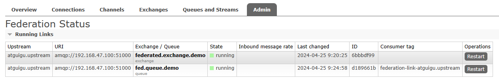


### ③执行测试

在上游节点向交换机发布消息：

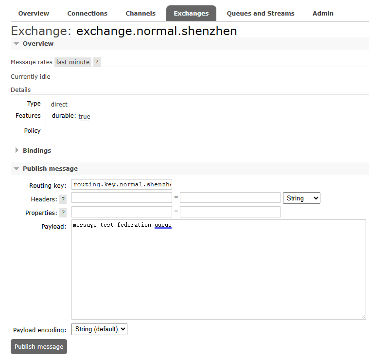


但此时发现下游节点中联邦队列并没有接收到消息，这是为什么呢？这里就体现出了联邦队列和联邦交换机工作逻辑的区别。

对联邦队列来说，如果没有监听联邦队列的消费端程序，它是不会到上游去拉取消息的！

如果有消费端监听联邦队列，那么首先消费联邦队列自身的消息；如果联邦队列为空，<span style="color:blue;">**这时候才**</span>会到上游队列节点中拉取消息。

所以现在的测试效果需要消费端程序配合才能看到：

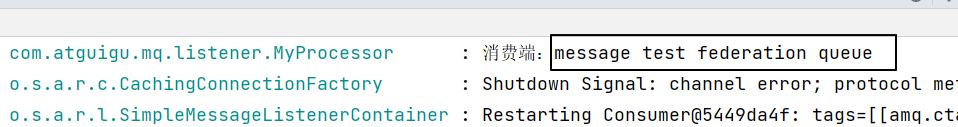